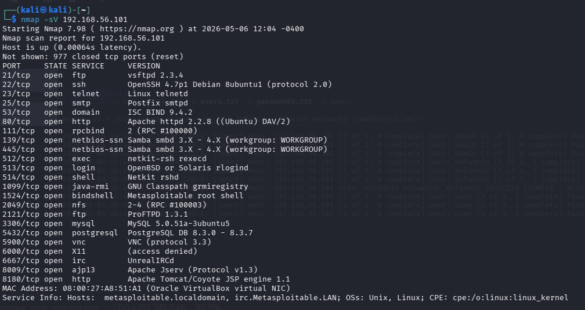
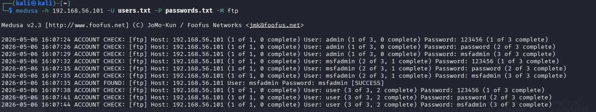
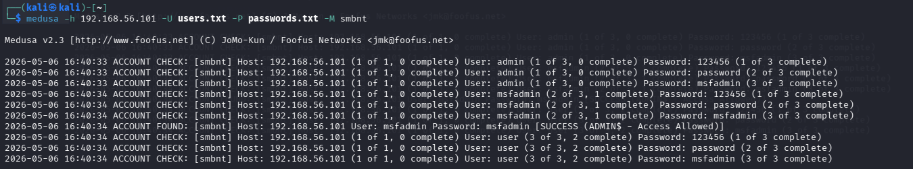
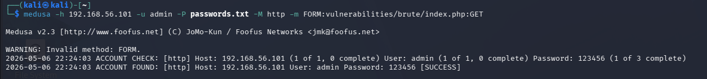

# 🛡️ Cybersecurity Lab: Exploração de Força Bruta e Segurança Defensiva

## 📝 Introdução
Este projeto foi desenvolvido para o desafio prático da **DIO**, focado em simular cenários reais de ataques de força bruta em um ambiente de laboratório controlado. O objetivo foi explorar vulnerabilidades em serviços comuns (FTP, SMB e Web) e propor medidas de mitigação baseadas nos resultados obtidos.

## 🚀 Desafios Técnicos e Superação
Durante a execução, enfrentei limitações de hardware que exigiram adaptações estratégicas para concluir o projeto com sucesso:
*   **Gestão de Recursos (RAM):** Otimizei o ambiente configurando o Metasploitable 2 com apenas 256MB e o Kali Linux com 1GB, utilizando o modo "Headless" e minimizando janelas para evitar travamentos.
*   **Manipulação de Wordlists:** Devido a incompatibilidades de layout de teclado no terminal do Kali, utilizei comandos como `printf` e `cat` para criar wordlists personalizadas manualmente, garantindo a precisão da sintaxe necessária para o Medusa.
*   **Fluxo de Trabalho Híbrido:** Para poupar memória, utilizei o navegador do sistema anfitrião (Windows) para configurar o laboratório web (DVWA), realizando o ataque estritamente via terminal no Kali. Também utilizei um servidor HTTP via Python3 para transferir as capturas de tela do Kali para o Windows via rede local, permitindo o upload final para o GitHub.

*   ## 🛠️ Metodologia de Transferência de Dados
Devido à instabilidade do ambiente gráfico da máquina virtual e à falha nas ferramentas nativas de "arrastar e largar", implementei uma solução de rede para exportar as evidências (prints):

1.  **Servidor HTTP Local:** No terminal do Kali, dentro da pasta de imagens, executei `python3 -m http.server 9000` para transformar a pasta num servidor web temporário.
2.  **Interconexão de Rede:** Configurei a VM em modo **Host-Only**, estabelecendo uma comunicação direta entre o Windows e o Kali.
3.  **Extração de Evidências:** Acedi ao IP da VM através do navegador **Google Chrome no Windows**, permitindo o download estável dos ficheiros para o upload final no GitHub.

## 🔍 Desenvolvimento do Laboratório

### 1. Reconhecimento (Nmap)
Realizei a enumeração de serviços para identificar portas abertas e versões de protocolos no alvo:
- **Comando:** `nmap -sV 192.168.56.101`
- **Resultado:** Portas 21 (FTP), 445 (SMB) e 80 (HTTP) identificadas como abertas.
> 

### 2. Força Bruta em FTP
Simulação de quebra de autenticação no protocolo de transferência de ficheiros:
- **Ferramenta:** Medusa
- **Comando:** `medusa -h 192.168.56.101 -U users.txt -P passwords.txt -M ftp`
> 

### 3. Password Spraying e Enumeração em SMB
Realizei a enumeração de utilizadores e o ataque de "borrifagem" de senhas contra o serviço de partilha de ficheiros:
- **Comando:** `medusa -h 192.168.56.101 -U users.txt -P passwords.txt -M smbnt`
> 

### 4. Ataque Web (DVWA)
Exploração de formulário de login vulnerável em nível de aplicação:
- **Configuração:** Segurança do DVWA definida como "LOW".
- **Comando:** `medusa -h 192.168.56.101 -u admin -P passwords.txt -M http -m FORM:vulnerabilities/brute/index.php:GET`
> 

## 🛡️ Medidas de Prevenção (O que aprendi)
Para evitar o sucesso destes ataques em ambientes reais, as defesas principais são:
1. **Senhas Fortes:** A utilização de credenciais complexas invalida ataques baseados em dicionários comuns.
2. **Políticas de Bloqueio (Lockout):** Bloquear IPs ou utilizadores após 3-5 tentativas falhadas interrompe a automação de ferramentas como o Medusa.
3. **Protocolos Seguros:** Migrar de serviços sem criptografia (FTP) para versões protegidas (SFTP/SSH).

## 🏁 Conclusão
O projeto demonstrou que a segurança de um sistema depende tanto da robustez dos protocolos quanto da gestão de credenciais. A prática permitiu consolidar conhecimentos de rede, manipulação de terminal Linux e pensamento crítico na resolução de problemas técnicos.
